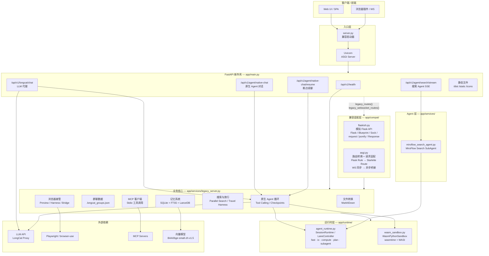
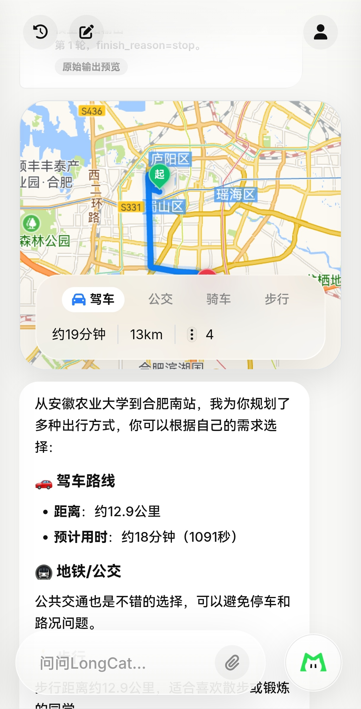
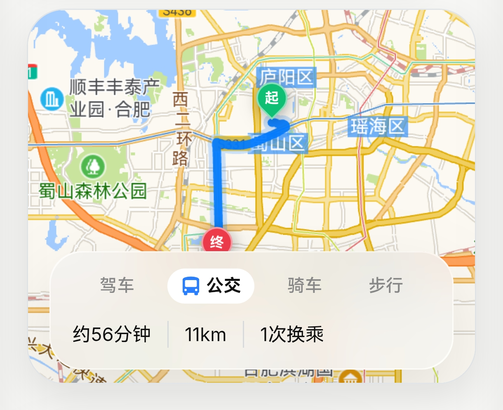

# Blanket Life in One Agent

> 我们认为一款成功的 Agent 软件，必定具备以下三个特质：
>
> **1. Memory 与个性化**  
> 模型能力的进步日新月异，每一家都曾短暂霸榜。但无论是 Codex 还是 Claude Code，都很难真正做到用户量领先——原因是它们的目标用户高强度关注模型能力，而平台切换对用户几乎没有门槛。当某一家模型领先时，用户便可以快速迁移到另一个平台。真正能够留住用户的，是系统对用户长期习惯、偏好和上下文的持续积累。
>
> **2. GUI-first**  
> GUI 大幅降低了用户使用门槛。以 Coding Agent 为例，Codex 等平台在推出对应 App 后，用户量较只有 CLI 版本时激增。对普通用户而言，可视化的交互界面远比命令行更接近自然使用方式。
>
> **3. 尊重 Human-in-the-loop**  
> 本地生活推荐的准确性受多种复杂因素影响：天气、时间、用户喜好、当下心境等。目前大部分 Agent 直接代替用户做决定，仅把 Human-in-the-loop 放在敏感权限（如支付授权）上，这本身扼杀了用户探索的广度和兴趣。好的 Agent 应该在关键决策点邀请用户参与，而不是替用户关闭可能性。
>
> 我们认为 AI 时代，软件绝不仅仅局限于人与机交互的效率提速，更应该是发生在人与人之间的。
>
> 出于此，我们打造了 Blanket。

## 架构图

## 🟢 1. 记忆系统

对 Blanket 来说，记忆不是简单的"记住用户说过什么"，而是让用户感到被理解、被持续服务的关键资产。我们把它设计成三层递进结构： raw 素材层、structured 记忆层、semantic 表达层，并在每一层都加入了对相关性、多样性和隐私安全的保护。

### _RAW 素材层：保留可读取的原始上下文_

RAW 层保存每次对话的原始消息。在上下文窗口允许时，模型可以直接读取这些原消息，而不是只能看到被压缩后的摘要。这让 Agent 能够捕捉到语气、犹豫、临时修改等细腻信息。

当对话变长、接近上下文上限时，系统会启动分层保护策略：

- **优先保护头尾**：开头的 system 提示和前几条关键消息、以及最近的几轮对话会被完整保留
- **中间内容智能压缩**：较早的中间轮次会先被 LLM summarize 成一段简洁的「前文提要」，而不是简单截断丢弃
- **工具结果特殊处理**：旧的工具输出会先被替换成一句话摘要；重复的工具输出会被标记为「与近期内容相同」
- **保持工具对完整性**：压缩边界会避开 assistant 的 tool_calls 和对应的 tool 结果之间，防止出现「模型说调用了工具，但找不到返回结果」的断层。如果确实被截断，也会插入占位说明，而不是让模型困惑

结果是：长对话的尾部细节仍然完整可用，中间历史以摘要形式保留核心信息，系统不会因为长度而突然丢失上下文。

### _Structured 记忆层：从混沌中提炼事实_

系统会自动从对话中识别出值得保留的信息，并把它们整理成结构化的记忆条目：

- **你是谁** —— 名字、身份、职业等画像信息
- **你喜欢什么** —— 饮食偏好、沟通风格、关注领域
- **你讨厌什么 / 你的约束** —— 忌口、过敏、明确的边界
- **你正在做的事** —— 长期项目、待办目标、计划中的旅行
- **杂项笔记** —— 其他稳定但暂时无法归类的信息

这些记忆不是简单的原文摘抄，而是经过 LLM 理解和格式化的"事实"，带有置信度和来源标记。用户可以显式确认一条记忆，也可以让系统自动推断。

### _Semantic 表达层：让记忆真正可用_

结构化记忆要进一步变成模型好读、检索好找的形式：

- **原子事实**把每条记忆压缩成一句精确的陈述
- **叙事片段**把同一主题的多条记忆串成一段小 story
- **前瞻事项**识别出计划、 deadline、提醒等未来需要关注的内容
- **场景标签**自动把记忆归类到"旅行与本地生活""研究与论文""代码与工程"等主题桶

最终，它们会被统一成检索单元，供后续的混合搜索使用。

### _匹配与注入：只在对的时间出现对的记忆_

当用户发起一次新的 Agent 请求时，Blanket 会同时做几件事：

1. **理解意图** —— 把当前问题或近期对话变成检索查询
2. **多路召回** —— 同时走全文搜索、向量相似度、词袋匹配，避免任何一路漏掉关键记忆
3. **多样性筛选** —— 用 MMR 算法保证返回的记忆不会全部堆在同一个主题上，而是尽量覆盖不同维度
4. **分区配额** —— 沟通偏好、约束、项目、事实等类别各有进入 prompt 的上限，防止某一类记忆刷屏
5. **动态拼接** —— 把精选记忆整理成结构化的背景文本，附加到最后一条 user 消息中，让模型在当前问题的上下文中自然获得相关背景

我们给模型定的规则很简单：**这些记忆是背景参考，如果和当前对话冲突，以当前对话为准。**

### _冲突与进化：记忆会自己长大，也会自己纠错_

人的偏好是会变的。今天说"回复简洁一点"，下周可能又说"这次帮我展开详细讲讲"。Blanket 会检测这种冲突：

- 如果新记忆是用户明确确认的，它会取代旧记忆
- 如果新旧记忆互相矛盾但证据都不够强，它们会被标记为"待决冲突"，等待更多证据
- 系统会周期性地整理记忆库，合并重复项、清理过期候选、刷新用户画像

这样，Blanket 对你的理解会随时间越来越准，而不是被早期的一两条片面信息锁死。

### _隐私安全：你的位置、密码、密钥不会被偷渡进上下文_

记忆注入前会经过安全检查：

- 精确经纬度不会作为普通记忆被召回，只在导航、 weather 等明确需要位置的工具中被单独解析
- API Key、密码、Token 等敏感内容会被识别并过滤
- Prompt Injection 攻击模式会被拦截
- 用户可以随时查看、编辑、删除自己的记忆

这样，即使对话很长，Agent 也不会突然「失忆」，而是像人一样保留近期细节、压缩远期细节，并定期更新纠正记忆。

## 🟢 2. function call，让模型 think to action

注册了 native 的 tool，并在部分 tool 里规范了多种子 tool，以应对不同的情景，还能控制上下文消耗。

| 层级 | 工具 | 说明 |
|---|---|---|
| **编排与容器** | `plan_task` | DAG 计划容器，只写入/更新计划，后续由调度器将步骤转为 tool_call 执行 |
| | `spawn_agent` | 子 Agent 容器，启动独立进程或 WASM 沙箱任务 |
| | ├─ `run_wasm_python` | `spawn_agent(isolation=wasm)` 的实际执行体 |
| | └─ *(子 Agent 内授权工具)* | 由 `resolved_tool_names` 控制可调用的工具集合 |
| **任务生命周期** | `task_create` | 仅注册 pending 任务，不启动执行 |
| | ├─ `task_get` / `task_list` / `task_output` | 读取任务状态与输出 |
| | └─ `task_stop` | 停止运行中的任务 |
| **团队协作** | `create_team` | 创建 agent team 与 mailbox |
| | └─ `send_to_agent` | 向 team 中指定 agent 的 mailbox 发消息 |
| **工具发现** | `tool_search` | 按需检索并动态加载其他工具的 schema 到上下文 |
| **子代理型业务工具** | `search_web` | 启动 SearchSubAgent，内部完成搜索→选源→抓取→验证→摘要 |
| | `search_movies` | 启动 MovieSubAgent，返回电影卡片 |
| **本地生活** | `search_merchants` | 启动 MerchantSubAgent，召回高德商户候选池 |
| | └─ `select_merchant_cards` | 依赖 `search_merchants` 产出的 merchant_pool，做偏好筛选并生成最终卡片 |
| | `get_weather` | 实时天气与预报 |
| | `get_time` | 当前时间/日期 |
| | `search_train_tickets` | 12306 火车票/高铁查询 |
| | <b>`resolve_location_anchor`</b> | 解析用户保存的位置锚点（家/公司等），输出常作为后续位置类工具的入参 |
| | <b>`plan_navigation`</b> | 启动 NavigationSubAgent，规划路线与导航 |
| **信息查询（叶子）** | `search_memory` | 读取用户长期记忆与会话摘要 |
| | `search_papers` | 学术论文查询（arxiv / pubmed 等） |
| **代码执行（叶子）** | `run_wasm_python` | 在 WASI WebAssembly 沙箱中执行纯 Python |
| **用户交互（叶子）** | `ask_user_clarification` | 发起问卷并挂起会话等待用户确认 |
| **展示（依赖前置）** | `display_cards` | 依赖前置工具注册的 `card_artifacts`，选择并展示 artifact 卡片 |

## 🟢 3. Agent 框架

挑选 agentic 的 LongCat 2.0 来驱动只是第一步，好的 agent 框架才能激发出模型的潜力和保证效果的下限。

Blanket 的 Agent 循环不是简单的"模型说调什么工具就调什么"，而是一个完整的推理-执行-观察-再推理的闭环。模型每一轮输出的工具调用会被解析、分批、并行执行，结果再回注到上下文中，驱动下一轮决策。这个循环有明确的预算边界：时间上限、token 上限、轮次上限。当模型卡在某个步骤反复兜圈子时，系统会自动收紧预算并尝试降级策略，而不是无限消耗下去。

### _DAG 计划：把复杂请求拆成一张可执行的流程图_

当用户说"帮我找家附近评分高的火锅店，再看看电影，最后规划一下怎么过去"时，Agent 面临的不是一个工具调用，而是一连串有先后、有依赖的任务。如果让模型每轮自由发挥，它可能在查完电影后忘记要规划路线，也可能在路线还没确定时就急着选餐厅。

Blanket 的做法是：模型先画一张「流程图」，把大目标拆成带依赖关系的小步骤，然后交给调度器按图执行。这张流程图就是 DAG（有向无环图）。每个步骤明确标注三件事：做什么（tool_name）、怎么做（args）、以及要等谁做完（depends_on）。比如"查天气"和"搜商户"可以并行，"规划路线"必须等"选好目的地"之后才能开始。

一旦 DAG 建立，Agent 循环就会进入「按计划执行」模式。调度器每一轮只干一件事：检查哪些步骤的前置依赖已经满足，把它们标记为"就绪"，然后并发拉起执行。步骤跑完后更新状态，再检查下一批就绪步骤。模型不再需要每轮都重新思考"接下来该干什么"，它只需要在计划卡住或需要调整时出手干预。

这种设计带来了几个明显的好处：

- **减少重复思考**：计划定好后，执行阶段不再消耗模型的决策 token，上下文更干净
- **并行加速**：没有依赖关系的步骤同时跑，整体耗时不是步骤之和而是关键路径之和
- **执行可预期**：每个步骤的目标和参数都是预先写好的，不会像自由调用那样中途发散
- **自动恢复**：某一步失败，只要不阻塞其他分支，剩余步骤仍会继续推进
- **卡住自动重构**：如果计划连续多轮没有可执行步骤，系统会主动提示模型用 replan 模式重构流程图，而不是无限空转

当然，DAG 不是万能药。对于那些只有一两个简单工具调用的请求，直接执行反而更快。只有当请求涉及两个以上独立步骤、且步骤之间有明确的先后或并行关系时，DAG 才值得被启用。

### _WASM 沙箱：给代码执行加一道轻量安全锁_

Agent 不可避免地需要执行代码。模型可能想算一笔账、排个序、验证一段逻辑，甚至 spawn 一个子 agent 跑一段 Python。如果把这些代码直接放进主进程执行，一旦出错就可能拖垮整个系统。

Blanket 为此引入了 WASM 沙箱。它像一个极度轻量的虚拟机，启动只需要几十毫秒，内存占用极低。你让模型写一段 Python 代码，它会跑在一个完全隔离的环境里：没有网络、没有 shell、不能读写宿主文件系统，甚至 CPU 指令执行量都有硬预算。如果代码写得不好死循环了，沙箱会在时间或预算耗尽时被强制中断，不会蔓延到外层。

这和传统的进程隔离有什么区别？进程隔离需要 fork 一个全新的操作系统进程，启动成本更高，适合长时间运行的重任务。而 WASM 沙箱更像是给代码套了一层一次性安全罩，适合那些"算完就扔"的小任务：JSON 清洗、文本打分、数据校验、轻量算法。`spawn_agent` 指定 `isolation=wasm` 时，子 agent 就在这个罩子里运行，跑完输出结果，罩子自动销毁。

它的能力边界也很清晰。由于无法访问网络，WASM 沙箱里的代码不能去查 API、不能下载文件、不能访问外部数据库。它只能拿到你通过 stdin 传进去的输入数据，算完之后通过 stdout 吐出一个 JSON。这种「输入-计算-输出」的极简模式，反而让模型更容易写出可控、可预期的小脚本。

### _性能优化：让 Agent 跑得又快又稳_

Agent 框架能不能跑得快，不只看模型本身有多聪明，还看执行管线设计得够不够紧凑。Blanket 在多个环节都做了加速设计。

**流式预执行**
模型在流式输出回答时，一旦工具调用的意图稳定下来，Blanket 就会在后台提前启动该工具。等模型最终确认要调用这个工具时，结果往往已经算好了。把"模型生成时间"和"工具执行时间"重叠，省掉一大段空白等待。

**进程池预热**
对于需要进程隔离的重任务，Blanket 维护了一个常驻进程池，后台线程会提前把 worker 进程启动好。等真正需要执行时直接复用，避免冷启动的 fork 开销。worker 跑多了还会自动换新，防止内存泄漏拖慢系统。

**多级缓存**
同一轮对话里，模型可能会反复查询天气、记忆、位置锚点等信息。Blanket 在 Session 级别做了结果缓存，重复调用直接秒回。WASM 运行时也会缓存已编译的模块，避免每次重新解析字节码。搜索类工具还有内存级缓存，短时间内重复查询直接返回之前的结果。

**五级车道**
所有工具调用被分到五档车道：fast、io、compute、plan、subagent。查时间、展示卡片走 fast 车道，并发位最多；网络查询走 io 车道，可以并行等待；复杂计算走 compute 车道，独占 CPU。轻量工具不会被重任务堵住。

**后台执行**
深度研究、轨迹反思等耗时任务可以丢到后台运行。用户可以继续聊天，等后台任务完成后结果自动注入对话。spawn_agent 也可以后台化，不卡主对话流。

**写时复制上下文**
多个工具并行执行时，Blanket 不会每次都深拷贝整份上下文。而是采用写时复制策略：只读数据共享引用，只有真正修改时才复制。这让并行子代理的启动成本从线性降到接近常数。

**自动 Checkpoint**
每轮工具执行后，系统会自动把当前状态保存到 SQLite。如果会话因用户确认被挂起、或系统意外中断，恢复时可以从断点继续，不需要从头重新执行前面所有工具。

**级联取消**
用户关闭页面或主动取消时，整个子代理树和后台任务会立即停止。父子令牌联动，避免资源在后台继续空转浪费。

## 🟢 4. 使用示例

### 案例 1：两点间规划

**用户输入**

> 我要从安徽农业大学导航去合肥南站

**系统响应**

Blanket 识别到这是一个导航规划请求，自动调用 `plan_navigation` 工具，结合用户当前位置和目的地，返回多条路线方案卡片：

**路线方案对比**

系统同时给出三种出行方式的详细对比，每种方案以独立卡片呈现，方便用户按需选择：

| 方案 | 方式 | 时长 | 距离 | 特点 |
|---|---|---|---|---|
| 方案一 | 地铁公交 | 约 49 分钟 | 15.8 公里 | 步行最少，换乘 1 次 |
| 方案二 | 地铁 | 约 47 分钟 | 16.0 公里 | 时间最短，步行 1.3 公里 |
| 方案三 | 驾车 | 约 29 分钟 | 15.6 公里 | 最快直达，适合有车用户 |

**方案卡片展示**

用户可以直接在卡片上切换方案，也可以进一步追问"哪条方案步行最少"或"打车大概多少钱"，Blanket 会基于已加载的路线上下文继续回答。
