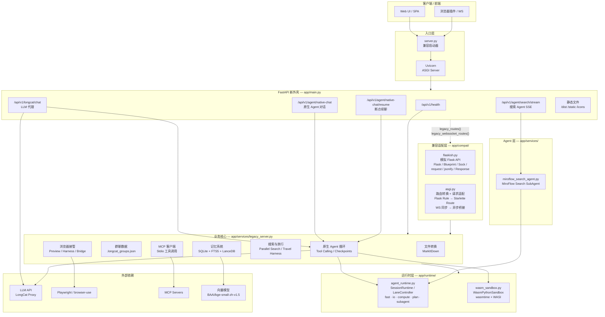

# Blanket Life in One Agent

> 我们认为一款成功的 Agent 软件，必定具备以下三个特质：
>
> **1. Memory 与个性化**  
> 模型能力的进步日新月异，每一家都曾短暂霸榜。但无论是 Codex 还是 Claude Code，都很难真正做到用户量领先——原因是它们的目标用户高强度关注模型能力，而平台切换对用户几乎没有门槛。当某一家模型领先时，用户便可以快速迁移到另一个平台。真正能够留住用户的，是系统对用户长期习惯、偏好和上下文的持续积累。
>
> **2. GUI-first**  
> GUI 大幅降低了用户使用门槛。以 Coding Agent 为例，Codex 等平台在推出对应 App 后，用户量较只有 CLI 版本时激增。对普通用户而言，可视化的交互界面远比命令行更接近自然使用方式。
>
> **3. 尊重 Human-in-the-loop**  
> 本地生活推荐的准确性受多种复杂因素影响：天气、时间、用户喜好、当下心境等。目前大部分 Agent 直接代替用户做决定，仅把 Human-in-the-loop 放在敏感权限（如支付授权）上，这本身扼杀了用户探索的广度和兴趣。好的 Agent 应该在关键决策点邀请用户参与，而不是替用户关闭可能性。

## 架构图

## 原生注册工具（`legacy_server.py`）

| 类别 | 工具名 | 说明 |
|---|---|---|
| Agent 编排 | `spawn_agent` | 启动独立子 agent，支持后台运行、fork、WASM 隔离 |
| | `run_wasm_python` | 在 WASI WebAssembly 沙箱中执行纯 Python |
| 任务管理 | `task_create` / `task_get` / `task_list` / `task_stop` / `task_output` | 创建、查询、停止、读取 agent task |
| 团队协作 | `create_team` / `send_to_agent` | 创建 agent team 与 mailbox 消息 |
| 工具发现 | `tool_search` | 按需检索并动态加载工具 schema |
| 用户交互 | `ask_user_clarification` | 发起问卷并挂起会话等待用户确认 |
| 计划执行 | `plan_task` | 创建/更新 DAG 执行计划，支持 depends_on 依赖 |
| 信息查询 | `search_web` | 联网搜索（由搜索子代理完成抓取与验证） |
| | `search_memory` | 读取用户长期记忆与会话摘要 |
| | `resolve_location_anchor` | 解析用户保存的位置锚点（家/公司等） |
| 生活服务 | `search_merchants` / `select_merchant_cards` | 商户候选池查询与卡片筛选 |
| | `search_movies` | 电影卡片查询 |
| | `search_papers` | 学术论文查询（arxiv / pubmed 等） |
| | `get_weather` | 实时天气与预报 |
| | `get_time` | 当前时间/日期 |
| | `search_train_tickets` | 12306 火车票/高铁查询 |
| | `plan_navigation` | 路线规划与导航 |
| 展示 | `display_cards` | 选择并展示已生成的 artifact 卡片 |

## Agent 框架（`legacy_server.py`）

核心原生 Agent 循环 `_native_create_agent_run` 实现了以下机制：

- **动态预算系统**（`_NativeIterationBudget`）：wall 时间上限、token 预算、软/硬轮次上限、卡死检测与自动降级
- **多轮工具调用**：模型自主决策 → 解析 tool calls → 并行/流式执行 → 结果回注 → 下一轮推理
- **DAG 计划拦截器**：当存在 `plan_task` 创建的活跃计划时，按 `depends_on` 依赖关系调度步骤执行
- **会话挂起与恢复**：`ask_user_clarification` 等工具可挂起会话；支持 checkpoint 断点恢复与 `native-chat/resume` 续跑
- **工具执行隔离**：根据工具类型自动选择进程隔离（process pool）、WASM 沙箱或同进程执行
- **流式预执行**：安全工具可在模型流式输出期间提前启动，减少等待延迟
- **工具重复策略**：自动检测低质量结果并决定重试、合并或丢弃
- **Lane 调度集成**：工具执行落入 `fast / io / compute / plan / subagent` 五车道，由 `agent_runtime.py` 统一管控并发与资源

## 分层说明

| 层级 | 关键文件 | 职责 |
|---|---|---|
| 入口层 | `server.py` | 读取环境变量，启动 Uvicorn |
| FastAPI 外壳 | `app/main.py` | 新接口实现 + 挂载遗留路由 + 静态文件 |
| 兼容层 | `app/compat/flaskish.py` `app/compat/asgi.py` | 迁移兼容flask代码 |
| 业务核心 | `app/services/legacy_server.py` | 记忆、文件转换、浏览器、Agent、搜索、旅行等业务逻辑 |
| 运行时 | `app/runtime/agent_runtime.py` `app/runtime/wasm_sandbox.py` | 会话级 Lane/Resource 调度、WASM 沙箱执行 |
