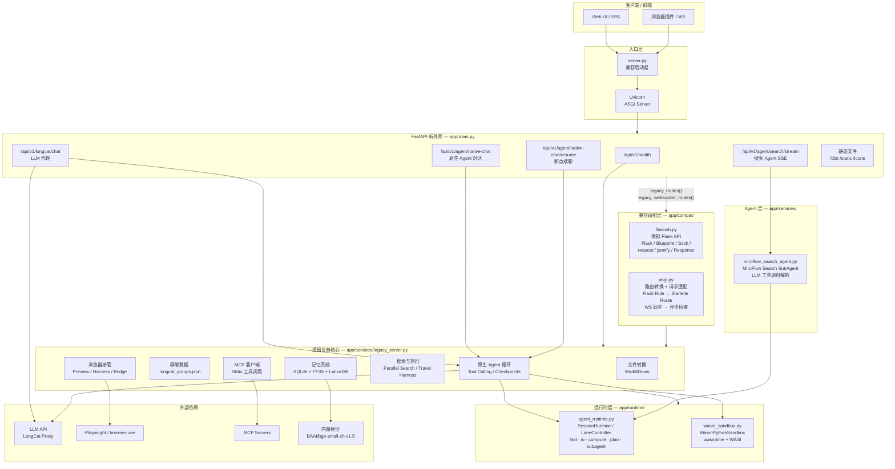

# Blanket Life in One Agent

> LongCat Backend — FastAPI 外壳 + Flask 遗留业务核心的混合架构。

## 架构图

## 分层说明

| 层级 | 关键文件 | 职责 |
|---|---|---|
| 入口层 | `server.py` | 读取环境变量，启动 Uvicorn |
| FastAPI 外壳 | `app/main.py` | 新接口实现 + 挂载遗留路由 + 静态文件 |
| 兼容层 | `app/compat/flaskish.py` `app/compat/asgi.py` | 让旧 Flask 代码无需重写即可跑在 FastAPI 上 |
| 遗留业务核心 | `app/services/legacy_server.py` | 3.3 万行业务逻辑：记忆、文件转换、浏览器、Agent、搜索、旅行 |
| 运行时 | `app/runtime/agent_runtime.py` `app/runtime/wasm_sandbox.py` | 会话级 Lane/Resource 调度、WASM 沙箱执行 |
| Agent | `app/services/miroflow_search_agent.py` | 搜索子 Agent、LLM 工具调用解析 |
